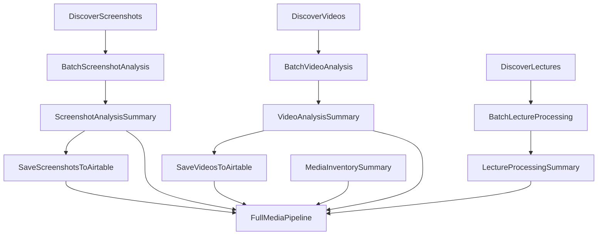

# d6tflow Media AI Pipeline Guide

## Overview

This guide covers the d6tflow-based workflow system for the Media AI Pipeline. d6tflow provides robust, cacheable, and dependency-aware task execution for complex media analysis workflows.

## Architecture

### Task Hierarchy

```
Media AI Pipeline (d6tflow)
├── Data Ingestion Tasks
│   ├── DiscoverScreenshots
│   ├── DiscoverVideos
│   ├── DiscoverLectures
│   └── MediaInventorySummary
├── Analysis Tasks
│   ├── Screenshot Tasks
│   │   ├── AnalyzeSingleScreenshot
│   │   ├── BatchScreenshotAnalysis
│   │   └── ScreenshotAnalysisSummary
│   ├── Video Tasks
│   │   ├── AnalyzeSingleVideo
│   │   ├── BatchVideoAnalysis
│   │   └── VideoAnalysisSummary
│   └── Lecture Tasks
│       ├── ProcessSingleLecture
│       ├── BatchLectureProcessing
│       ├── LectureProcessingSummary
│       └── LectureSearchTask
├── Storage Tasks
│   ├── SaveScreenshotsToAirtable
│   ├── SaveVideosToAirtable
│   ├── QueryMediaData
│   ├── ExportAnalysisResults
│   └── CleanupOldData
└── Pipeline Orchestrators
    ├── FullMediaPipeline
    ├── ScreenshotOnlyPipeline
    ├── VideoOnlyPipeline
    └── LectureOnlyPipeline
```

### Task Dependencies



## Quick Start

### 1. Basic Setup

Ensure d6tflow is installed:
```bash
pip install d6tflow
```

Test the configuration:
```bash
python d6tflow_cli.py status
```

### 2. Run Your First Pipeline

```bash
# Run screenshot analysis only (safest for testing)
python d6tflow_cli.py run --screenshots --limit 3

# Run full pipeline with small limits
python d6tflow_cli.py run --full --screenshot-limit 2 --video-limit 1 --lecture-limit 1
```

## Command Line Interface

### Available Commands

#### `run` - Execute Pipelines

**Full Pipeline:**
```bash
# Run everything with default limits
python d6tflow_cli.py run --full

# Custom limits for each component
python d6tflow_cli.py run --full \
  --screenshot-limit 10 \
  --video-limit 5 \
  --lecture-limit 2

# Skip certain components
python d6tflow_cli.py run --full --no-lectures --no-airtable
```

**Individual Pipelines:**
```bash
# Screenshots only
python d6tflow_cli.py run --screenshots --limit 5 --batch-size 3

# Videos with custom keyframes
python d6tflow_cli.py run --videos --limit 3 --keyframes 7

# Lectures with advanced features
python d6tflow_cli.py run --lectures \
  --limit 2 \
  --lecture-dir ~/my-lectures \
  --advanced-diarization \
  --model-size large-v3
```

**Time-based Processing:**
```bash
# Only process files from last 24 hours
python d6tflow_cli.py run --screenshots --recent-hours 24

# Process recent files across all types
python d6tflow_cli.py run --full --recent-hours 12
```

#### `query` - Search Processed Media

```bash
# Basic queries
python d6tflow_cli.py query "screenshots with Python code"
python d6tflow_cli.py query "error messages"
python d6tflow_cli.py query "terminal commands"

# Type-specific queries
python d6tflow_cli.py query "machine learning" --type lectures
python d6tflow_cli.py query "debugging session" --type videos

# Limited results
python d6tflow_cli.py query "API calls" --limit 5
```

#### `status` - Check System Status

```bash
# Basic status
python d6tflow_cli.py status

# Detailed information
python d6tflow_cli.py status --verbose
```

#### `export` - Export Results

```bash
# Export all results as JSON
python d6tflow_cli.py export --format json --output results.json

# Export only screenshots as CSV
python d6tflow_cli.py export --format csv --no-videos --no-lectures

# Export specific components
python d6tflow_cli.py export --no-screenshots --output lecture_data.json
```

#### `cleanup` - Manage Data

```bash
# Clean up old data (dry run first)
python d6tflow_cli.py cleanup --days 30 --dry-run

# Actually clean up
python d6tflow_cli.py cleanup --days 30 --airtable --cache
```

## Python API Usage

### Direct Task Execution

```python
import d6tflow
from d6tflow_pipeline import FullMediaPipeline, ScreenshotOnlyPipeline
from d6tflow_screenshot_tasks import ScreenshotAnalysisSummary

# Run a specific task
task = ScreenshotAnalysisSummary(limit=5)
d6tflow.run(task)

# Load results
results = task.output().load()
print(f"Analyzed {results['successful_analyses']} screenshots")
```

### Using Helper Functions

```python
from d6tflow_pipeline import (
    run_full_pipeline,
    run_screenshot_pipeline,
    query_pipeline_results
)

# Run pipelines
screenshot_results = run_screenshot_pipeline(limit=10, recent_hours=24)
full_results = run_full_pipeline(
    screenshot_limit=5,
    video_limit=2,
    lecture_limit=1
)

# Query results
search_results = query_pipeline_results(
    "screenshots with error messages",
    media_type="screenshots",
    limit=5
)
```

### Advanced Task Configuration

```python
from d6tflow_config import PipelineConfig, TaskParams
from d6tflow_screenshot_tasks import BatchScreenshotAnalysis

# Custom task parameters
params = TaskParams.screenshot_analysis(limit=20, recent_hours=48)
task = BatchScreenshotAnalysis(**params)

# Run with custom configuration
d6tflow.run(task)
```

## Configuration

### Main Configuration (`d6tflow_config.py`)

Key settings you can modify:

```python
class PipelineConfig:
    # Processing limits
    DEFAULT_SCREENSHOT_LIMIT = 10  # Adjust based on your needs
    DEFAULT_VIDEO_LIMIT = 5
    DEFAULT_LECTURE_LIMIT = 3
    
    # Batch sizes (affects performance vs memory)
    BATCH_SIZE_SCREENSHOTS = 5
    BATCH_SIZE_VIDEOS = 2
    
    # File processing
    MAX_FILE_SIZE_MB = 50
    
    # Parallel processing
    MAX_WORKERS = 3
```

### Environment Variables

Required:
```bash
OPENAI_API_KEY=your_key_here
```

Optional:
```bash
AIRTABLE_API_KEY=your_airtable_key
MEDIA_AIRTABLE_BASE_ID=your_base_id
HUGGING_FACE_TOKEN=your_hf_token
```

## Task Details

### Data Ingestion Tasks

**DiscoverScreenshots**
- Scans PNG directory for image files
- Filters by file size and modification time
- Outputs: DataFrame with file metadata

**DiscoverVideos**
- Scans MP4 directory for video files
- Excludes files too large for processing
- Outputs: DataFrame with file metadata

**DiscoverLectures**
- Identifies video files suitable for lecture processing
- Filters by minimum file size (assumes lectures are substantial)
- Outputs: DataFrame with lecture file metadata

**MediaInventorySummary**
- Combines all discovery results
- Removes duplicates (videos counted as both videos and lectures)
- Outputs: Comprehensive inventory with statistics

### Analysis Tasks

**Screenshot Analysis:**
1. `BatchScreenshotAnalysis` - Processes screenshots in configurable batches
2. `ScreenshotAnalysisSummary` - Generates comprehensive analysis summary

**Video Analysis:**
1. `BatchVideoAnalysis` - Extracts keyframes and analyzes them
2. `VideoAnalysisSummary` - Aggregates video analysis results

**Lecture Processing:**
1. `BatchLectureProcessing` - Transcribes audio with speaker diarization
2. `LectureProcessingSummary` - Summarizes transcription results
3. `LectureSearchTask` - Provides semantic search over transcripts

### Storage Tasks

**SaveScreenshotsToAirtable** / **SaveVideosToAirtable**
- Saves analysis results to Airtable (if configured)
- Handles errors gracefully
- Tracks success rates

**QueryMediaData**
- Natural language queries over processed media
- Routes to appropriate search backends
- Unified result format

**ExportAnalysisResults**
- Exports results in JSON or CSV format
- Configurable component inclusion
- File and console output

**CleanupOldData**
- Removes old analysis data
- Configurable retention period
- Supports Airtable and local cleanup

## Performance Optimization

### Batch Sizes

Adjust batch sizes based on your system:

```python
# For faster processing (more memory usage)
PipelineConfig.BATCH_SIZE_SCREENSHOTS = 10
PipelineConfig.BATCH_SIZE_VIDEOS = 5

# For lower memory usage (slower processing)
PipelineConfig.BATCH_SIZE_SCREENSHOTS = 3
PipelineConfig.BATCH_SIZE_VIDEOS = 1
```

### Parallel Processing

d6tflow automatically handles task-level parallelism. For CPU-intensive tasks:

```python
PipelineConfig.MAX_WORKERS = 4  # Adjust based on CPU cores
```

### Caching

d6tflow automatically caches task results. To force re-execution:

```bash
# Remove specific task cache
rm -rf d6tflow_data/TaskName_*

# Clear all caches (use with caution)
rm -rf d6tflow_data/
```

## Troubleshooting

### Common Issues

**"Task already complete" but you want to re-run:**
```bash
# Find and remove the specific task cache
find d6tflow_data -name "*ScreenshotAnalysis*" -delete
```

**Memory issues with large batches:**
```python
# Reduce batch sizes in d6tflow_config.py
BATCH_SIZE_SCREENSHOTS = 2
BATCH_SIZE_VIDEOS = 1
```

**Missing dependencies:**
```bash
# Check if all required packages are installed
python -c "import d6tflow, openai, chromadb; print('All dependencies OK')"
```

### Debug Mode

Enable detailed logging:

```python
import logging
logging.basicConfig(level=logging.DEBUG)

# Then run your pipeline
```

### Task Status Inspection

```python
import d6tflow
from d6tflow_screenshot_tasks import ScreenshotAnalysisSummary

# Check if task is complete
task = ScreenshotAnalysisSummary(limit=5)
print(f"Task complete: {task.complete()}")

# Get task output path
if task.complete():
    print(f"Output at: {task.output().path}")
```

## Examples

### Example 1: Quick Screenshot Analysis

```bash
# Test with a few screenshots
python d6tflow_cli.py run --screenshots --limit 3

# Query the results
python d6tflow_cli.py query "code screenshots"
```

### Example 2: Video Analysis Workflow

```bash
# Process recent videos with custom keyframes
python d6tflow_cli.py run --videos --recent-hours 48 --keyframes 8

# Export results
python d6tflow_cli.py export --format json --no-screenshots --no-lectures
```

### Example 3: Lecture Processing Pipeline

```bash
# Process lectures with advanced diarization
python d6tflow_cli.py run --lectures \
  --limit 2 \
  --lecture-dir ~/lecture-videos \
  --advanced-diarization

# Search lecture content
python d6tflow_cli.py query "machine learning algorithms" --type lectures
```

### Example 4: Full Production Pipeline

```bash
# Production run with reasonable limits
python d6tflow_cli.py run --full \
  --screenshot-limit 20 \
  --video-limit 10 \
  --lecture-limit 5 \
  --recent-hours 168  # Last week

# Export everything
python d6tflow_cli.py export --format json --output weekly_analysis.json
```

### Example 5: Python API Usage

```python
from d6tflow_pipeline import run_full_pipeline, query_pipeline_results

# Run pipeline with custom parameters
results = run_full_pipeline(
    screenshot_limit=15,
    video_limit=8,
    lecture_limit=3,
    recent_hours=72,
    enable_airtable=False  # Skip Airtable for faster processing
)

print(f"Processed {results['summary']['total_files_processed']} files")
print(f"Success rate: {results['summary']['overall_success_rate']:.1f}%")

# Search the processed content
search_results = query_pipeline_results("error debugging session")
print(f"Found {search_results['results_count']} relevant items")

for result in search_results['results'][:3]:
    print(f"- {result.get('filename', 'Unknown')}: {result.get('summary', 'No summary')[:100]}...")
```

## Advanced Features

### Custom Task Creation

Create your own d6tflow tasks:

```python
import d6tflow
import pandas as pd

class CustomAnalysisTask(d6tflow.tasks.TaskPqPandas):
    param = d6tflow.Parameter()
    
    def requires(self):
        from d6tflow_screenshot_tasks import BatchScreenshotAnalysis
        return BatchScreenshotAnalysis()
    
    def run(self):
        # Load input data
        input_data = self.input().load()
        
        # Perform custom analysis
        result_data = self.custom_analysis(input_data)
        
        # Save results
        self.save(result_data)
    
    def custom_analysis(self, data):
        # Your custom logic here
        return data

# Use your custom task
task = CustomAnalysisTask(param="my_value")
d6tflow.run(task)
```

### Integration with External Systems

```python
from d6tflow_storage_tasks import ExportAnalysisResults
from my_external_system import upload_to_system

# Export and upload to external system
export_task = ExportAnalysisResults(
    export_format='json',
    output_path='/tmp/results.json'
)
d6tflow.run(export_task)

# Upload to external system
with open('/tmp/results.json') as f:
    upload_to_system(f.read())
```

## Best Practices

1. **Start Small**: Always test with small limits first
2. **Monitor Resources**: Watch CPU, memory, and API usage
3. **Use Recent Filters**: Process recent files first for quick feedback
4. **Cache Awareness**: Understand when tasks will be re-executed
5. **Error Handling**: Check task results for errors before proceeding
6. **Backup Important Results**: Export critical analysis results
7. **Cost Management**: Monitor OpenAI token usage for large runs

## Support and Debugging

If you encounter issues:

1. Check the status: `python d6tflow_cli.py status`
2. Run with small limits first
3. Check the d6tflow_data directory for cached results
4. Enable debug logging for detailed error information
5. Review the task dependency graph for bottlenecks

For more help, check the individual module documentation and the main README.md file.

---

**Happy analyzing with d6tflow!** 🚀
