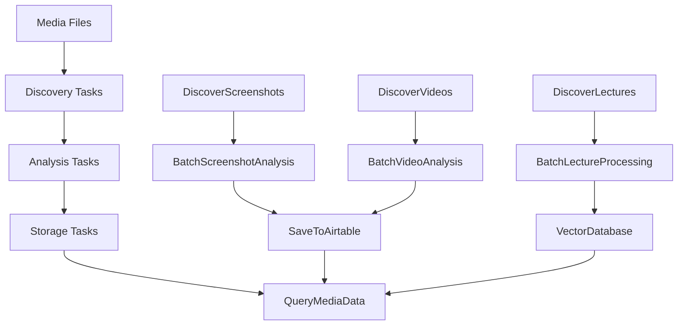

# d6tflow Media AI Pipeline 🚀

[](https://github.com/d6t/d6tflow)
[](https://python.org)
[](https://openai.com)

> **A robust, production-ready workflow system for AI-powered media analysis**

This directory now contains a complete d6tflow implementation of the Media AI Pipeline, transforming it from simple scripts into a sophisticated workflow engine with dependency management, caching, error handling, and scalable processing.

## 🎯 What is d6tflow?

d6tflow is a Python library for building robust data science workflows. It provides:
- **Automatic dependency management** - Tasks only run when needed
- **Intelligent caching** - Results are cached to avoid re-computation  
- **Error resilience** - Failed tasks don't break the entire pipeline
- **Incremental processing** - Only process what has changed
- **Parallel execution** - Run independent tasks concurrently

## 🏗️ Architecture Overview



## 📁 File Structure

```
media_ai_pipeline/
├── d6tflow Implementation
│   ├── d6tflow_config.py           # Configuration and parameters
│   ├── d6tflow_ingestion_tasks.py  # File discovery tasks
│   ├── d6tflow_screenshot_tasks.py # Screenshot analysis 
│   ├── d6tflow_video_tasks.py      # Video analysis
│   ├── d6tflow_lecture_tasks.py    # Lecture processing
│   ├── d6tflow_storage_tasks.py    # Data storage and queries
│   ├── d6tflow_pipeline.py         # Pipeline orchestrators
│   └── d6tflow_cli.py              # Command-line interface
│
├── Documentation
│   ├── D6TFLOW_GUIDE.md            # Complete user guide
│   ├── D6TFLOW_IMPLEMENTATION_SUMMARY.md
│   ├── example_d6tflow_usage.py    # Practical examples
│   └── README_D6TFLOW.md           # This file
│
├── Generated Directories  
│   ├── d6tflow_data/               # Task results cache
│   └── workflow_outputs/           # Pipeline outputs
│
└── Original Pipeline (unchanged)
    ├── media_pipeline.py
    ├── screenshot_analyzer.py
    ├── video_analyzer.py
    ├── lecture_processor.py
    └── ... (other original files)
```

## 🚀 Quick Start

### 1. Check System Status
```bash
python d6tflow_cli.py status
```

### 2. Test with Screenshots (Recommended First Step)
```bash
# Analyze just 3 screenshots to test the system
python d6tflow_cli.py run --screenshots --limit 3
```

### 3. Run Full Pipeline
```bash
# Small test run
python d6tflow_cli.py run --full \
  --screenshot-limit 5 \
  --video-limit 2 \
  --lecture-limit 1

# Production run (adjust limits as needed)
python d6tflow_cli.py run --full \
  --screenshot-limit 50 \
  --video-limit 20 \
  --lecture-limit 10
```

### 4. Query Your Media
```bash
python d6tflow_cli.py query "screenshots with Python code"
python d6tflow_cli.py query "error messages" --type screenshots
python d6tflow_cli.py query "machine learning" --type lectures
```

### 5. Export Results
```bash
python d6tflow_cli.py export --format json --output my_analysis.json
```

## 💡 Key Benefits

### vs. Original Pipeline
| Feature | Original | d6tflow Version |
|---------|----------|-----------------|
| **Caching** | None | ✅ Automatic |
| **Error Handling** | Basic | ✅ Robust |
| **Dependencies** | Manual | ✅ Automatic |
| **Incremental** | No | ✅ Yes |
| **Parallel** | No | ✅ Yes |
| **Resumable** | No | ✅ Yes |
| **Scalable** | Limited | ✅ Configurable |

### Real-World Benefits
- 🔄 **Resume interrupted runs** - If processing fails, restart where you left off
- ⚡ **Skip completed work** - Only reprocess changed files
- 🛡️ **Error isolation** - One failed file doesn't stop the entire batch
- 📊 **Better monitoring** - Track progress and success rates
- ⚙️ **Flexible execution** - Run full pipeline or specific components
- 🔍 **Rich querying** - Search processed media with natural language

## 🎛️ Configuration

### Key Settings (`d6tflow_config.py`)
```python
class PipelineConfig:
    DEFAULT_SCREENSHOT_LIMIT = 10    # Adjust for your needs
    DEFAULT_VIDEO_LIMIT = 5
    DEFAULT_LECTURE_LIMIT = 3
    
    BATCH_SIZE_SCREENSHOTS = 5       # Balance speed vs memory
    BATCH_SIZE_VIDEOS = 2
    
    MAX_WORKERS = 3                  # Parallel processing
```

### Environment Variables
```bash
# Required
OPENAI_API_KEY=your_key_here

# Optional
AIRTABLE_API_KEY=your_airtable_key
MEDIA_AIRTABLE_BASE_ID=your_base_id
HUGGING_FACE_TOKEN=your_hf_token
```

## 📚 Usage Patterns

### Command Line
```bash
# Development/Testing
python d6tflow_cli.py run --screenshots --limit 5
python d6tflow_cli.py run --videos --limit 2 --keyframes 8

# Production
python d6tflow_cli.py run --full --recent-hours 168  # Last week
python d6tflow_cli.py export --format json --output weekly.json

# Maintenance  
python d6tflow_cli.py cleanup --days 30 --dry-run
```

### Python API
```python
from d6tflow_pipeline import run_full_pipeline, query_pipeline_results

# Run pipeline
results = run_full_pipeline(
    screenshot_limit=20,
    video_limit=10,
    recent_hours=72  # Last 3 days
)

# Query results
searches = query_pipeline_results("debugging screenshots")
```

## 🔧 Advanced Features

### Custom Task Parameters
```python
# Fine-tune processing
from d6tflow_config import TaskParams

params = TaskParams.screenshot_analysis(
    limit=50,
    recent_hours=48
)
```

### Selective Pipeline Execution
```bash
# Skip certain components
python d6tflow_cli.py run --full --no-lectures --no-airtable

# Process only recent files
python d6tflow_cli.py run --videos --recent-hours 24
```

### Batch Size Optimization
```python
# In d6tflow_config.py - adjust based on your system
BATCH_SIZE_SCREENSHOTS = 10  # More memory, faster
BATCH_SIZE_SCREENSHOTS = 2   # Less memory, slower
```

## 🐛 Troubleshooting

### Common Issues

**"Task already complete" but you want to re-run:**
```bash
# Clear specific task cache
find d6tflow_data -name "*ScreenshotAnalysis*" -delete

# Or clear all caches (nuclear option)
rm -rf d6tflow_data/
```

**Out of memory errors:**
```python
# Reduce batch sizes in d6tflow_config.py
BATCH_SIZE_SCREENSHOTS = 2
BATCH_SIZE_VIDEOS = 1
```

**Missing files or directories:**
```bash
# Check system status
python d6tflow_cli.py status --verbose
```

### Debug Mode
```python
import logging
logging.basicConfig(level=logging.DEBUG)
# Then run your pipeline
```

## 📖 Documentation

- **[D6TFLOW_GUIDE.md](D6TFLOW_GUIDE.md)** - Complete user guide with examples
- **[example_d6tflow_usage.py](example_d6tflow_usage.py)** - 7 practical examples
- **[D6TFLOW_IMPLEMENTATION_SUMMARY.md](D6TFLOW_IMPLEMENTATION_SUMMARY.md)** - Technical details

## 🆚 When to Use d6tflow vs Original

### Use d6tflow When:
- ✅ Processing large media collections (100+ files)
- ✅ Need to resume interrupted processing
- ✅ Want to avoid reprocessing unchanged files  
- ✅ Running regular/scheduled analysis
- ✅ Need robust error handling
- ✅ Want parallel processing
- ✅ Building production workflows

### Use Original When:
- ✅ Quick one-off analysis (< 20 files)
- ✅ Testing new features
- ✅ Learning how the system works
- ✅ Simple scripting needs

## 🚦 Getting Started Recommendation

1. **First time?** Start with: `python d6tflow_cli.py status`
2. **Test run:** `python d6tflow_cli.py run --screenshots --limit 3`
3. **Learn more:** Read [D6TFLOW_GUIDE.md](D6TFLOW_GUIDE.md)
4. **Production:** Scale up limits based on your needs

## 🤝 Integration

The d6tflow implementation:
- ✅ **Preserves** all original functionality
- ✅ **Extends** with workflow management
- ✅ **Coexists** with original scripts
- ✅ **Uses** the same analysis engines
- ✅ **Maintains** compatibility with Airtable
- ✅ **Adds** CLI and Python APIs

You can use both systems simultaneously - d6tflow for production workflows and the original scripts for quick experiments.

---

## 🎉 Ready to Use!

Your Media AI Pipeline now has two modes:

1. **Original Mode** - Direct scripts for quick analysis
2. **d6tflow Mode** - Production workflow engine

Choose the right tool for your task and enjoy robust, scalable media analysis! 🚀

For questions or issues, check the documentation or examine the example files.
